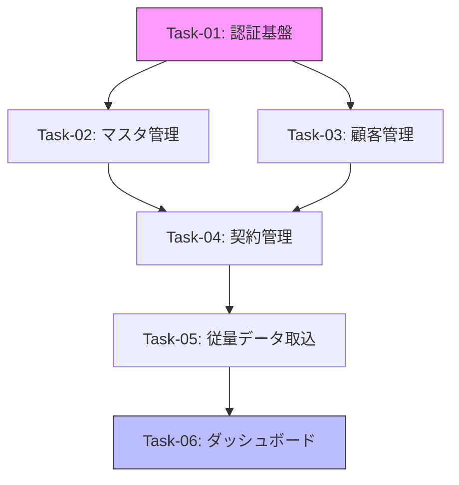

# 開発計画策定スキル

仕様ドキュメント (`docs/specs/{feature}/`) を入力とし、ユースケースシナリオ単位で
開発タスクを分割した計画を `docs/specs/{feature}/plan/` に出力する。

## 呼び出し規約

> **このスキルは `[dev-plan] {feature}` の形式で呼び出されたときだけ動作する。**

| 呼び出し例 | 動作 |
|---|---|
| `[dev-plan] saas-management-app` | ✅ 実行する — `docs/specs/saas-management-app/` を対象 |
| `[dev-plan] billing-feature` | ✅ 実行する — `docs/specs/billing-feature/` を対象 |
| `開発計画を作って` | ❌ 実行しない — `[dev-plan]` プレフィックスがない |
| `saas-management-app の計画を立てて` | ❌ 実行しない — `[dev-plan]` プレフィックスがない |

### ガード条件

1. ユーザーの入力が `[dev-plan] {feature}` の形式でない場合は、正しい呼び出し方を案内して終了する
2. `docs/specs/{feature}/` ディレクトリが存在しない場合はエラーを返す
3. `{feature}` が空の場合は、利用可能なディレクトリ一覧を `docs/specs/` から提示する

## パイプラインにおける位置づけ

```
                    ┌─ dev-implement → dev-unit-test → playwright-generate-test      (Web)
[dev-plan] ─────────┤
    ↑ このスキル     └─ mobile-implement → mobile-unit-test → maestro-generate-test   (Mobile)
```

1. **このスキル (dev-plan)**: `docs/specs/{feature}/` の仕様を読み、開発計画を策定する
2. **dev-implement / mobile-implement**: 計画をもとに実装する
3. **dev-unit-test / mobile-unit-test**: 実装に対して単体テストを構築する
4. **playwright-generate-test / maestro-generate-test**: AC をもとに E2E テストを構築する

`{feature}` はユーザーが指定する機能ディレクトリ名（例: `saas-management-app`, `saas-portal-mobile-app`）。

### プラットフォーム判定

`{feature}` の仕様ドキュメントに含まれるプラットフォーム情報に基づき、下流スキルが決まる。

| feature の内容 | 下流パイプライン |
|---|---|
| React + FastAPI (Web アプリ) | dev-implement → dev-unit-test → playwright-generate-test |
| Kotlin/Compose + Swift/SwiftUI (モバイルアプリ) | mobile-implement → mobile-unit-test → maestro-generate-test |

## このスキルを使うタイミング

- 新しい機能の **開発計画** を立てるとき
- 仕様ドキュメントから **実装タスクを分割** するとき
- タスクごとの **Acceptance Criteria** を定義するとき
- タスク間の **依存関係と並行実行可否** を整理するとき

## 前提条件

- 仕様ドキュメントが `docs/specs/{feature}/` に存在すること
  - ビジネス仕様: `business/` 配下
  - システム仕様: `system/` 配下
- 仕様は以下を含むこと: 画面設計、データモデル、認証設計、機能要件

## 出力構造

```
docs/specs/{feature}/plan/
├── summary.md                    # 計画サマリ（依存図・実行順序・概要）
├── task-01-{name}.md             # タスク定義
├── task-02-{name}.md
├── ...
└── task-NN-{name}.md
```

## ワークフロー

### Step 1: 仕様ドキュメントの読み込みと分析

- [ ] `docs/specs/{feature}/` 配下の全ドキュメントを読み込む
- [ ] README.md から全体スコープと Phase 分けを把握する
- [ ] ビジネス仕様から機能要件・優先度・ユーザーロールを抽出する
- [ ] システム仕様からデータモデル・画面構成・認証設計・運用フローを抽出する

### Step 2: ユースケースシナリオの抽出

仕様からユーザーが **実際に操作して確認できる単位** のシナリオを抽出する。

分割基準:
1. **1つの画面フロー** を端から端まで動かして確認できること
2. **バックエンドAPI + フロントエンドUI** がセットで動作確認できること
3. 粒度は「1つの CRUD」や「1つの業務フロー」程度

例:
- 「製品マスタの一覧表示・登録・編集・削除ができる」
- 「CSVアップロードでバリデーション→プレビュー→確定ができる」
- 「ダッシュボードで超過アラートが表示される」

### Step 3: タスク定義の作成

各タスクを以下のフォーマットで定義する。

```markdown
# Task-{NN}: {タスク名}

## 概要
{このタスクで実現すること（1〜3文）}

## スコープ

### バックエンド
- {実装する API エンドポイント}
- {実装するサービス / スキーマ}

### フロントエンド（Web の場合）
- {実装するページ / コンポーネント}
- {実装するフック / API クライアント}

### モバイル（Mobile の場合）
- {Android: 実装する Screen / ViewModel / Repository}
- {iOS: 実装する View / ViewModel / Service}
- {testTag / accessibilityIdentifier の付与対象}

### データモデル
- {使用するコレクション}
- {必要なシードデータ}

## Acceptance Criteria

各項目は E2E テストシナリオとして実行可能な形式で記述する。

- [ ] AC-{NN}-01: {ユーザーが〜したとき、〜が表示される}
- [ ] AC-{NN}-02: {〜のデータを送信すると、〜が保存される}
- [ ] AC-{NN}-03: {権限のないユーザーが〜すると、エラーが表示される}

## 依存関係
- 前提タスク: {依存する Task-ID のリスト、または "なし"}
- 並行実行: {他タスクと並行可能かどうか}

## 実装メモ
- {実装時の注意事項、仕様書からの引用など}
```

### Step 4: 計画サマリの作成

`summary.md` に以下を含める。

#### 4-1. タスク一覧テーブル

```markdown
| Task ID | タスク名 | 優先度 | 依存先 | 並行可 | AC数 |
|---------|---------|--------|--------|--------|------|
| Task-01 | ...     | 高     | なし   | Yes    | 3    |
| Task-02 | ...     | 高     | Task-01| No     | 4    |
```

#### 4-2. 依存関係図（Mermaid）

```markdown

```

#### 4-3. 推奨実行順序

並行実行が可能なタスクをグループ化し、Wave 形式で提示する。

```markdown
## 推奨実行順序

### Wave 1（並行実行可）
- Task-01: 認証基盤
- Task-02: 製品マスタ CRUD

### Wave 2（Wave 1 完了後）
- Task-03: 顧客管理
- Task-04: 契約管理

### Wave 3（Wave 2 完了後）
- Task-05: 従量データ取込
- Task-06: ダッシュボード
```

#### 4-4. 前提確認事項

計画を作成する中で発見した仕様の曖昧な点や確認が必要な事項をリストアップする。

### Step 5: 批判的レビュー（1回目）

計画全体を以下の観点でレビューする。

- [ ] **スコープの妥当性:** 各タスクが大きすぎず小さすぎないか
- [ ] **AC の検証可能性:** 各 Acceptance Criteria が具体的で E2E テスト化できるか
- [ ] **依存関係の正確性:** 循環依存がないか、必要な依存が漏れていないか
- [ ] **並行実行の安全性:** 並行可としたタスクが本当に独立しているか
- [ ] **仕様との整合性:** 仕様ドキュメントの要件がすべてタスクに含まれているか
- [ ] **Phase 境界:** MVP / Phase 2 の切り分けが仕様と一致しているか

### Step 6: 修正と最終レビュー（必要な場合のみ・最大1回追加）

レビューで問題が見つかった場合は修正し、再度レビューする。
2回のレビューを上限とし、完璧を求めすぎない。

## タスク分割の指針

### 適切な粒度

| ✅ 良い粒度 | ❌ 粒度が大きすぎる | ❌ 粒度が小さすぎる |
|---|---|---|
| 製品マスタ CRUD | マスタ管理全体 | 製品マスタの GET API |
| CSV取込フロー全体 | データ管理機能全部 | CSV バリデーションの1ルール |
| ログイン〜トークン発行 | 認証と認可全部 | パスワードハッシュ関数 |

### Acceptance Criteria の書き方

**良い AC:**
- `AC-01-01: 管理者が製品名「CloudCRM Pro」を登録すると、製品一覧に表示される`
- `AC-03-02: 営業担当者が担当外の顧客を編集しようとすると、403エラーが返る`
- `AC-05-01: 10件の月次実績CSVをアップロードすると、プレビュー画面に10件が表示される`
- `AC-02-01: テナントユーザーがログインすると、ダッシュボードに利用状況サマリーが表示される`（Mobile）
- `AC-04-03: サービス一覧画面でアプリをタップすると、アプリ起動画面に遷移する`（Mobile）

**悪い AC:**
- `製品マスタが動作する` → 何を確認するか不明
- `エラーハンドリングが実装されている` → テスト化できない

## 下流スキルとの連携

### Web パイプライン

- **dev-implement** スキル: 各 task-NN ファイルのスコープを読み、FastAPI + React の実装を行う
- **dev-unit-test** スキル: スコープのバックエンド/フロントエンドから単体テスト対象を特定する
- **playwright-generate-test** スキル: Acceptance Criteria を Web E2E テストシナリオに変換する

### Mobile パイプライン

- **mobile-implement** スキル: 各 task-NN ファイルのスコープを読み、Kotlin/Compose + Swift/SwiftUI + Portal Backend の実装を行う
- **mobile-unit-test** スキル: スコープの Android/iOS/Backend から単体テスト対象を特定する
- **maestro-generate-test** スキル: Acceptance Criteria を Maestro E2E テストフローに変換する

## チェックリスト

- [ ] 仕様ドキュメントの全要件がいずれかのタスクに含まれている
- [ ] すべてのタスクに具体的な Acceptance Criteria がある
- [ ] 依存関係図が Mermaid で summary.md に含まれている
- [ ] 推奨実行順序が Wave 形式で記載されている
- [ ] 批判的レビューを1回以上実施済み

## トラブルシューティング

| 症状 | 原因 | 対応 |
|------|------|------|
| タスクが20個以上になる | 粒度が細かすぎる | 関連するAPIをまとめて1タスクにする |
| AC が曖昧で E2E 化できない | ユーザー操作が書かれていない | 「〜が〜したとき〜になる」の形式に書き直す |
| 依存関係が複雑すぎる | タスク分割が不適切 | 共通基盤（認証等）を独立タスクに切り出す |
| 仕様に書かれていない要件がある | 仕様の不足 | 前提確認事項として summary.md に記載する |
