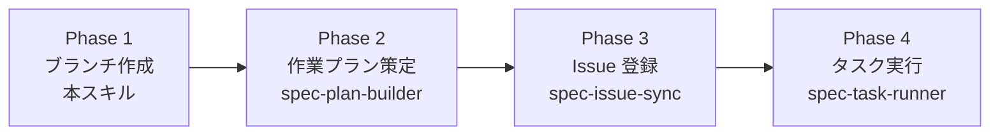

# 仕様書ドリブン開発ワークフロー（オーケストレーター）

## トリガー条件

> **このスキルは `/spec <作業名>` と明示的に入力された場合のみ実行する。**
> 「仕様を実装して」「specを見て作って」等の曖昧な指示では実行しない。
> トリガー例: `/spec ユーザー管理`, `/spec search-feature`

## 概要

`docs/specs/{作業名}/` に記載された仕様書をもとに、4つのフェーズで開発を進める。
Phase 2〜4 はそれぞれ専用のサブスキルが担当し、本スキルは全体の流れを制御する。



各フェーズの完了時に Git commit + push を行い、作業状態を常にリモートに反映する。

## サブスキル一覧

| スキル | 担当 | 単独トリガー |
|---|---|---|
| `spec-plan-builder` | Phase 2: 仕様→作業プラン分解・plan.json 生成 | `/spec-plan <作業名>` |
| `spec-issue-sync` | Phase 3: plan/ → GitHub Issue 登録・依存関係設定 | `/spec-issues <作業名>` |
| `spec-task-runner` | Phase 4: plan.json に基づくタスク実行・監視 | `/spec-run <作業名>` |

## Phase 1: 作業ブランチの作成（本スキルが直接実行）

### 手順

1. `docs/specs/{作業名}/` の存在を確認する。存在しない場合はエラー終了
2. 作業名が日本語の場合は英語に翻訳する
3. ブランチ名を `feature/<英語作業名>` の形式で作成する（kebab-case）
4. `main` ブランチから作業ブランチを作成・チェックアウトする
5. リモートにプッシュする

```bash
git checkout main && git pull
git checkout -b feature/<英語作業名>
git push -u origin feature/<英語作業名>
```

### ブランチ命名ルール

| 作業名（入力） | ブランチ名（出力） |
|---|---|
| ユーザー管理 | `feature/user-management` |
| search-feature | `feature/search-feature` |
| ダッシュボード画面 | `feature/dashboard-view` |

## Phase 2〜4: サブスキルへの委譲

Phase 1 完了後、以下の順でサブスキルの手順に従って作業を進める:

1. **`spec-plan-builder`** の手順に従い、作業プランを策定する
2. **`spec-issue-sync`** の手順に従い、GitHub Issue を登録する
3. **`spec-task-runner`** の手順に従い、タスクを実行・監視する

各サブスキルは独立しているため、途中で中断した場合もそのフェーズから再開できる。

## コミットメッセージ規約

| フェーズ | プレフィックス | 例 |
|---|---|---|
| プラン作成 | `docs:` | `docs: create work plan for ユーザー管理` |
| Issue 登録 | `docs:` | `docs: register GitHub Issues for ユーザー管理` |
| 実装 | `feat:` | `feat: task-001 add user model and migration` |
| テスト | `test:` | `test: task-001 add user model unit tests` |
| バグ修正 | `fix:` | `fix: task-002 correct user validation logic` |
| 進捗更新 | `docs:` | `docs: mark task-001 as done` |

すべてのコミットに以下の Co-authored-by トレイラーを付与する:

```
Co-authored-by: Copilot <223556219+Copilot@users.noreply.github.com>
```
