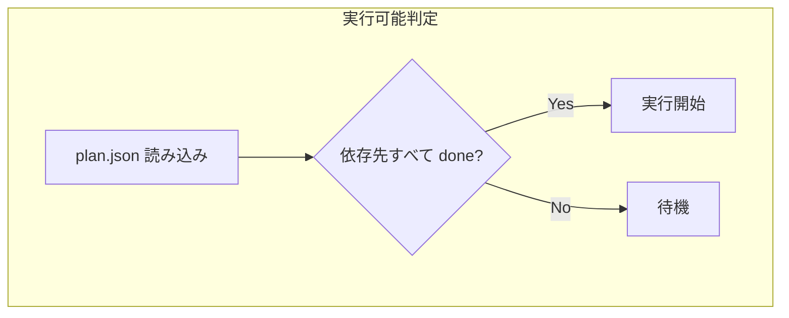

# タスク実行・監視スキル

## トリガー条件

> **このスキルは `[spec-run] <作業名>` と明示的に入力された場合のみ実行する。**
> `[spec]` ワークフローの Phase 4 として呼び出される場合も有効。

## 前提条件

- `docs/specs/{作業名}/plan/plan.json` が存在すること
- 各タスクに `issue_number` が設定済みであること（`spec-issue-sync` で登録済み）
- 作業ブランチがチェックアウトされていること

## 手順

### Step 1: 実行順序の決定

`plan.json` から依存関係グラフを構築し、実行順序を決定する:

1. 依存関係のないタスク（または依存先がすべて `done`）から開始
2. 同じ `parallel_group` 内のタスクは並行実行可能
3. `parallel: false` のタスクは順次実行



### Step 2: ローカルタスクの実行 (`execution: "local"`)

1. `plan.json` の `status` を `in_progress` に更新、コミット＆プッシュ
2. 作業を実施（実装、テスト作成、テスト実行）
3. 完了後にコミット＆プッシュ
4. `plan.json` の `status` を `done` に更新、コミット＆プッシュ

```bash
# ステータス更新
# plan.json の該当タスクの status を "in_progress" に更新
git add docs/specs/{作業名}/plan/plan.json
git commit -m "docs: start {task-id}"
git push

# 作業完了後
git add -A
git commit -m "feat: {task-id} {タスク概要}

Co-authored-by: Copilot <223556219+Copilot@users.noreply.github.com>"
git push

# ステータス完了
# plan.json の該当タスクの status を "done" に更新
git add docs/specs/{作業名}/plan/plan.json
git commit -m "docs: mark {task-id} as done

Co-authored-by: Copilot <223556219+Copilot@users.noreply.github.com>"
git push
```

### Step 3: 委任タスクの実行 (`execution: "delegate"`)

GitHub Coding Agent に委任するタスクは `/delegate` コマンドで実行する。

1. `plan.json` の `status` を `delegated` に更新、コミット＆プッシュ
2. `/delegate` コマンドで作業を委任する
3. Coding Agent が作成した PR の番号を `plan.json` の `pr_number` に記録

**重要**: 作成される PR のマージ先は作業ブランチ（`feature/{英語作業名}`）を指定する。

```
/delegate
Issue #{issue_number} の作業を実施してください。
PR のマージ先ブランチは `feature/{英語作業名}` です。
詳細は docs/specs/{作業名}/plan/{ファイル名} を参照してください。
```

### Step 4: 進捗監視

各タスクの進行状況を監視し、`plan.json` を随時更新する。

| 条件 | アクション |
|---|---|
| delegate タスクの PR がマージされた | `status` → `done` |
| delegate タスクの PR が失敗/クローズ | `status` → `failed`, `notes` に原因記録 |
| 依存先が `done` になった | 次のタスクの実行を開始 |
| タスクがブロック状態 | `status` → `blocked`, `notes` に理由記録 |

```bash
# PR の状態確認
gh pr view {pr_number} --json state,mergeStateStatus

# 全体の進捗確認
cat docs/specs/{作業名}/plan/plan.json | jq '.tasks[] | {id, status, issue_number, pr_number}'
```

### Step 5: 全タスク完了時

すべてのタスクが `done` になったら:

1. `plan.json` を最終更新（全タスクの完了を確認）
2. 最終コミット＆プッシュ
3. 作業ブランチから `main` への PR を作成

```bash
git add docs/specs/{作業名}/plan/plan.json
git commit -m "docs: all tasks completed for {作業名}

Co-authored-by: Copilot <223556219+Copilot@users.noreply.github.com>"
git push

gh pr create \
  --base main \
  --head feature/{英語作業名} \
  --title "feat: {作業名}" \
  --body "docs/specs/{作業名} の仕様に基づく実装。

## 完了タスク
$(cat docs/specs/{作業名}/plan/plan.json | jq -r '.tasks[] | "- [x] \(.id): \(.title) (#\(.issue_number))"')"
```

## リカバリ

このスキルは途中から再開可能:

- `plan.json` の `status` を確認し、`pending` または `failed` のタスクから処理を再開する
- `delegated` のタスクは PR の状態を確認して `done` / `failed` に更新してから次に進む
- `[spec-run] <作業名>` を再度実行すれば、未完了タスクのみ処理される
