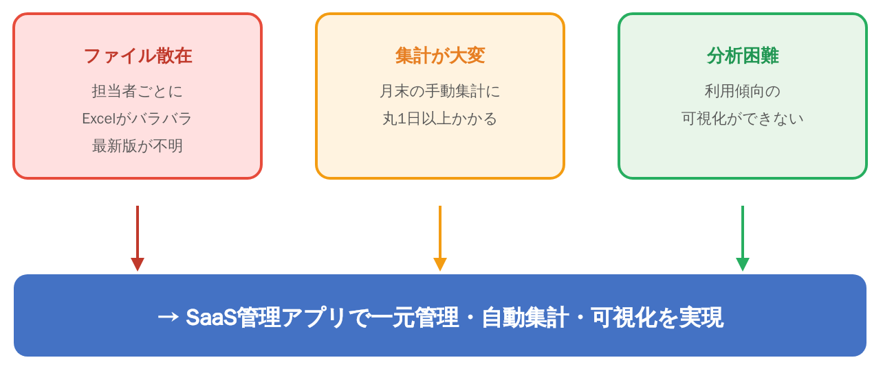

# 背景・課題・目的

## 背景

営業部門では、SaaS製品の顧客管理にExcelを利用している。担当者ごとにファイルが分散しており、以下の運用上の問題が発生している。

## 現状の課題

### 1. ファイル散在

- 担当者ごとにExcelがバラバラに管理されている
- 最新版がどれか分からなくなることが多い
- 表記揺れ（製品名・プラン名）によるデータ不整合が発生

### 2. 集計が大変

- 月末の手動集計に丸1日以上かかる
- 各SaaS製品の管理画面から月初にCSVをダウンロードし、担当者が手動でExcelに転記
- 更新は月次で、毎月5営業日目くらいまでに前月分をとりまとめる流れ
- 属人化しており引き継ぎが難しいという声がある

### 3. 分析困難

- 利用傾向の可視化ができない
- お客様への提案時に「こういう使われ方をしてます」とデータで見せられると説得力が全然違う

## 管理対象データ（現行）

営業担当サトウ氏によると、現在管理している主な項目は以下の通り：

- 顧客コード・顧客名
- 利用開始日・終了日
- 従量課金の単価と数量
- 担当者情報

これらが担当者ごとのExcelに散らばっており、月末の集計がかなり大変な状況にある。

## 目的

**SaaS管理アプリで一元管理・自動集計・可視化を実現する。**

具体的には：

1. 顧客・契約・課金データをWebアプリに集約し、担当者依存を排除
2. 従量データの取り込みフローを標準化し、属人化を解消
3. ダッシュボードによる利用傾向の可視化で営業提案力を向上
