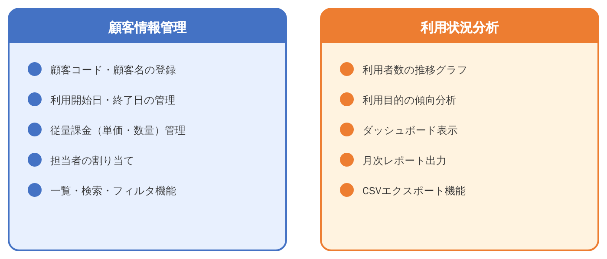
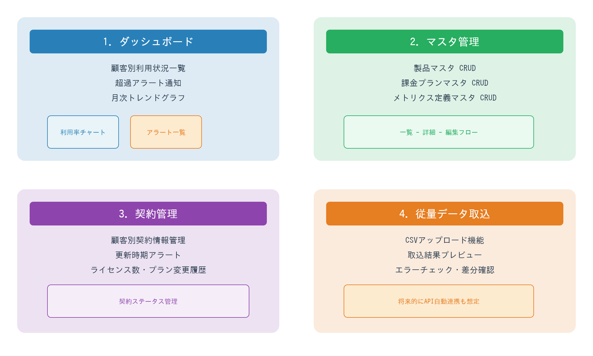
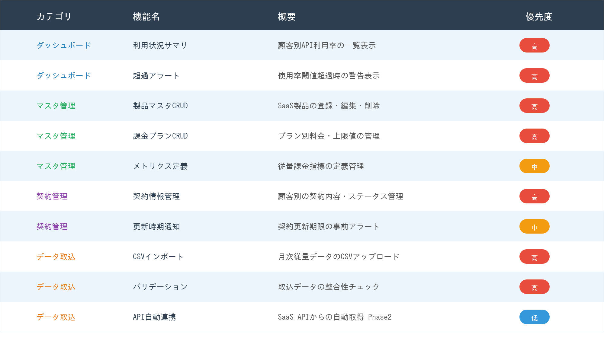

# 機能概要

## 機能一覧

本アプリの機能は大きく**顧客情報管理**と**利用状況分析**の2領域に分かれる。

### 顧客情報管理

- 顧客コード・顧客名の登録
- 契約開始日・終了日・更新日の管理
- 従量課金（単価・数量・閾値）管理
- 担当者の割り当て
- 一覧・検索・フィルタ機能

### 利用状況分析

- 利用者数 / API利用量などの月次推移グラフ
- 契約に設定した利用目的別の傾向分析
- ダッシュボード表示
- 月次CSVエクスポート機能
- 超過アラート表示

## 初回リリース範囲

- **プロトタイプ対象:** ダッシュボード、従量データ取込
- **MVP対象:** 4主要画面すべて + 管理者専用タブ（ユーザー管理、監査ログ確認）
- **Phase 2対象:** SaaS API自動連携、月中単価変更の自動按分、より高度な分析レポート

## 画面構成

4つの主要画面で構成される。管理者専用機能は既存画面の管理者タブとして提供し、情報設計を増やし過ぎない方針とする。

### 1. ダッシュボード

- 顧客別利用状況一覧
- 超過アラート通知（既定値90%、プラン単位で変更可能）
- 直近12ヶ月の月次トレンドグラフ
- 利用目的別サマリ（契約に設定した primary_use_case を集計）
- 最終更新日時の表示

### 2. マスタ管理

- 製品マスタ CRUD（SaaS製品の登録・編集・削除）
- 課金プランマスタ CRUD（プラン別料金・閾値・上限値の管理）
- 顧客マスタ CRUD（担当営業の割当、連絡先・検索条件管理）
- メトリクス定義マスタ CRUD（従量課金指標の定義管理）
- 管理者専用タブ：ユーザー管理、監査ログ閲覧

### 3. 契約管理

- 顧客別契約情報管理（契約内容・ステータス管理）
- 更新時期アラート（契約更新期限の事前アラート）
- ライセンス数・プラン変更履歴
- 契約ステータス管理
- 担当顧客のみ編集可、全件閲覧は管理者のみ

### 4. 従量データ取込

- CSVアップロード機能（月次従量データのCSVアップロード）
- 取込結果プレビュー
- エラーチェック・差分確認（取込データの整合性チェック）
- 同一月の再取込は**置換**として扱い、取込履歴に記録
- 将来的にAPI自動連携も想定

## 機能要件一覧（優先度付き）

| カテゴリ | 機能名 | 概要 | 優先度 | フェーズ |
|---|---|---|---|---|
| ダッシュボード | 利用状況サマリ | 顧客別の月次利用率と最終更新日時を表示 | **高** | プロトタイプ / MVP |
| ダッシュボード | 超過アラート | プラン閾値超過時の警告表示 | **高** | プロトタイプ / MVP |
| ダッシュボード | 利用目的分析 | primary_use_case 単位の集計表示 | 中 | MVP |
| マスタ管理 | 製品マスタCRUD | SaaS製品の登録・編集・削除 | **高** | MVP |
| マスタ管理 | 課金プランCRUD | プラン別料金・上限値・閾値の管理 | **高** | MVP |
| マスタ管理 | 顧客マスタCRUD | 顧客コード、担当営業、連絡先の管理 | **高** | MVP |
| マスタ管理 | メトリクス定義 | 従量課金指標の定義管理 | 中 | MVP |
| マスタ管理 | ユーザー管理 | 管理者による社内ユーザーの登録・無効化 | 中 | MVP |
| 契約管理 | 契約情報管理 | 顧客別の契約内容・ステータス管理 | **高** | MVP |
| 契約管理 | 更新時期通知 | 契約更新期限の事前アラート | 中 | MVP |
| 契約管理 | 変更履歴管理 | ライセンス数・プラン変更履歴の記録 | 中 | MVP |
| データ取込 | CSVインポート | 月次従量データのCSVアップロード | **高** | プロトタイプ / MVP |
| データ取込 | バリデーション | マスタ突合、重複検知、数値範囲チェック | **高** | プロトタイプ / MVP |
| データ取込 | 再取込（置換） | 同一対象月の確定データを再取り込み可能にする | 中 | MVP |
| データ取込 | API自動連携 | SaaS APIからの自動取得 | 低 | Phase 2 |
| レポート | 月次CSV出力 | 月次実績・契約一覧をCSVで出力 | 中 | MVP |
| レポート | 定型帳票出力 | PDF等の定型レポート出力 | 低 | Phase 2 |

## 現行データ例

Excel管理表（SaaS管理表_202603.xlsx）から抽出した現行の管理データ：

### 顧客別契約一覧（抜粋）

| No | 顧客名 | SaaS製品名 | プラン | 月額基本料(円) | ライセンス数 | 契約ステータス |
|---|---|---|---|---|---|---|
| 1 | ABC商事 | CloudCRM Pro | Enterprise | 480,000 | 150 | 契約中 |
| 2 | DEFホールディングス | CloudCRM Pro | Business | 280,000 | 80 | 契約中 |
| 3 | GHIテクノロジーズ | DataSync Hub | Standard | 150,000 | 30 | 契約中 |
| 4 | JKLメディア | CloudCRM Pro | Starter | 98,000 | 20 | 契約中 |
| 5 | MNO製造 | DataSync Hub | Enterprise | 350,000 | 100 | 契約中 |
| 6 | PQRサービス | AI Analytics | Professional | 220,000 | 45 | 契約中 |
| 7 | STUリテール | CloudCRM Pro | Business | 280,000 | 75 | 更新手続中 |
| 8 | VWXコンサル | AI Analytics | Enterprise | 520,000 | 200 | 契約中 |
| 9 | YZ建設 | DataSync Hub | Starter | 85,000 | 15 | 契約中 |
| 10 | あいう食品 | CloudCRM Pro | Enterprise | 480,000 | 120 | 契約中 |

### 超過リスク顧客（直近3ヶ月実績ベース）

| 顧客名 | 製品 | 2026/03 使用率 | 状況 |
|---|---|---|---|
| ABC商事 | CloudCRM Pro | 99.2% | 前月102.5%超過、要注視 |
| GHIテクノロジーズ | DataSync Hub | 108.6% | **超過発生** 超過料金 ¥21,500 |
| MNO製造 | DataSync Hub | 105.1% | **超過発生** 超過料金 ¥27,360 |
| DEFホールディングス | CloudCRM Pro | 96.2% | 上昇傾向、要注視 |
| PQRサービス | AI Analytics | 103.9% | **超過発生** 超過料金 ¥12,400 |
