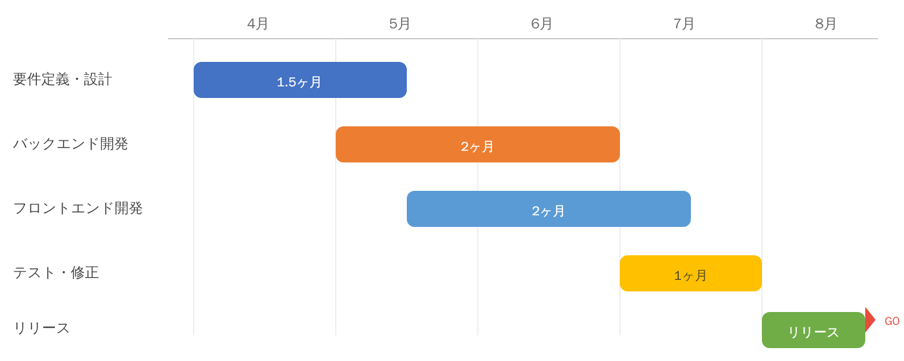

# 開発スケジュール

## スケジュール方針

初回リリースは2026年8月を目標とするが、**プロトタイプ検証 → 詳細要件確定 → MVP開発 → テスト / 移行** の順で段階的に進める。要件未確定のままバックエンド開発を本格開始しないことを前提とする。

## フェーズ一覧

| フェーズ | 期間 | 主な成果物 |
|---|---|---|
| プロトタイプ検証 | 4月上旬〜4月中旬 | ダッシュボード / 従量データ取込の画面たたき台、現行運用での検証結果 |
| 要件定義・詳細設計 | 4月中旬〜5月 | 4画面の詳細要件、認証設計、データモデル、CSV取込ルール |
| バックエンド実装 | 5月〜6月 | FastAPI API、JWT認証、MongoDB設計、CSV取込基盤 |
| フロントエンド実装 | 5月中旬〜7月 | React画面、ダッシュボード、マスタ / 契約 / 取込UI |
| テスト・移行リハーサル | 7月〜8月上旬 | Playwright E2E、UAT、Excel→MongoDB移行手順、リリース判定 |
| リリース準備 | 8月 | 本番反映、初回データ投入、運用引き継ぎ |

## フェーズ詳細

### 1. プロトタイプ検証

- ダッシュボードと従量データ取込を優先して試作する
- サトウ氏を中心に、現行の月次運用で不足がないかを確認する
- この段階では **業務適合性の検証** を目的とし、全機能を作り切ることは前提にしない

### 2. 要件定義・詳細設計

- 詳細要件定義（現行Excel運用、締め日、再取込ルールの確定）
- マスタデータ設計（製品・プラン・顧客・メトリクス・ユーザー）
- API設計（FastAPI エンドポイント、Pydanticスキーマ、認可ルール）
- 画面ワイヤーフレームと入力バリデーション定義

### 3. バックエンド実装

- FastAPI + MongoDB によるAPI実装
- JWT認証基盤、ロール別認可
- CSVインポート機能、取込監査ログ、再取込置換処理
- Excel移行用の事前データ整備

### 4. フロントエンド実装

- React + TypeScript + Vite によるSPA構築
- ダッシュボード（Recharts によるグラフ）
- マスタ管理 / 契約管理 / 従量データ取込画面
- 管理者専用タブ（ユーザー管理、監査ログ確認）

### 5. テスト・移行リハーサル

- 結合テスト・UAT
- Playwright による主要フロー自動テスト
- Excel → MongoDB の移行リハーサル、差分確認レポート作成
- ロール別の権限制御、再取込、更新アラートの確認

### 6. リリース準備

- 8月中の本番リリースを目標
- ステージング環境での最終確認後に本番切替
- ロールバック手順、初回運用担当、問い合わせ窓口を事前確定する

## フェーズ間の判定条件

- **プロトタイプ → 詳細設計:** 現行のCSV運用で画面 / フローが成立すること
- **詳細設計 → 実装:** 認証方式、権限境界、CSV再取込ルールが承認済みであること
- **実装 → テスト:** 4主要画面の主要APIとUIが接続済みであること
- **テスト → リリース:** UAT完了、移行リハーサル完了、運用体制確定

## 将来構想（Phase 2以降）

Phase 2では、SaaS製品APIからの自動データ取得と、月中単価変更の自動按分を見据える。

- CSVの手動取り込みを廃止し、月次バッチまたはWebhook連携でデータを自動取得
- 月中単価変更は契約変更履歴をもとに自動按分する
- より高度なレポート出力や提案支援機能を追加する
