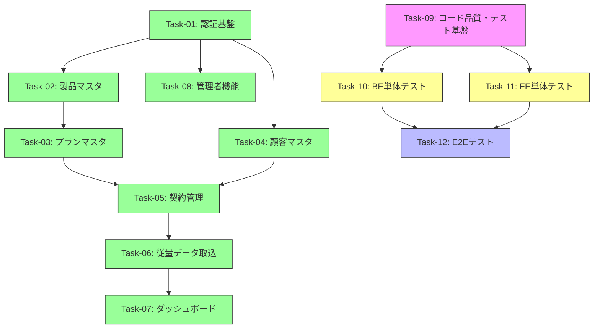

# 開発計画サマリ — SaaS管理アプリ (MVP)

## 概要

営業部門の Excel 管理を Web アプリに一元化する SaaS 管理アプリの MVP 開発計画。
12 のタスクに分割し、認証基盤を土台に段階的に構築する。

## 進捗状況

| フェーズ | ステータス |
|---------|-----------|
| 機能実装 (Task-01〜08) | ✅ 完了 |
| コード品質・テスト基盤 (Task-09) | ✅ 完了 |
| バックエンド単体テスト (Task-10) | ✅ 完了 |
| フロントエンド単体テスト (Task-11) | ✅ 完了 |
| E2E テスト (Task-12) | ✅ 完了 |

## タスク一覧

### 機能実装タスク（完了）

| Task ID | タスク名 | 優先度 | 依存先 | 並行可 | AC数 | 状態 |
|---------|---------|--------|--------|--------|------|------|
| Task-01 | 認証基盤・ログイン画面 | 高 | なし | — | 4 | ✅ |
| Task-02 | 製品マスタ・メトリクス定義 CRUD | 高 | Task-01 | Yes (Wave 2) | 6 | ✅ |
| Task-03 | プランマスタ CRUD | 高 | Task-02 | No | 4 | ✅ |
| Task-04 | 顧客マスタ CRUD | 高 | Task-01 | Yes (Wave 2) | 4 | ✅ |
| Task-05 | 契約管理 | 高 | Task-03, Task-04 | No | 5 | ✅ |
| Task-06 | 従量データ取込 | 高 | Task-05 | No | 5 | ✅ |
| Task-07 | ダッシュボード | 高 | Task-06 | No | 6 | ✅ |
| Task-08 | 管理者機能（ユーザー管理・監査ログ） | 中 | Task-01 | Yes (Wave 2) | 4 | ✅ |

### 品質・テストタスク（残作業）

| Task ID | タスク名 | 優先度 | 依存先 | 並行可 | AC数 | 状態 |
|---------|---------|--------|--------|--------|------|------|
| Task-09 | コード品質修正・テスト基盤構築 | 高 | なし | — | 6 | ✅ |
| Task-10 | バックエンド単体テスト | 高 | Task-09 | Yes (Wave 8) | 10 | ✅ |
| Task-11 | フロントエンド単体テスト | 高 | Task-09 | Yes (Wave 8) | 9 | ✅ |
| Task-12 | E2E テスト | 高 | Task-10, Task-11 | No | 10 | ✅ |

## 依存関係図

## 推奨実行順序

### Wave 1〜6（完了）
- Task-01〜08: 機能実装 ✅

### Wave 7（残作業開始）
- **Task-09:** コード品質修正・テスト基盤構築

### Wave 8（Task-09 完了後・並行実行可）
- **Task-10:** バックエンド単体テスト
- **Task-11:** フロントエンド単体テスト

### Wave 9（Task-10, Task-11 完了後）
- **Task-12:** E2E テスト

## スコープ

### MVP に含めるもの
- 4 主要画面（ダッシュボード、マスタ管理、契約管理、従量データ取込）
- JWT 認証（sales / admin の 2 ロール）
- 管理者専用タブ（ユーザー管理、監査ログ）
- CSV 手動取込（バリデーション・プレビュー・確定・置換）

### MVP に含めないもの（Phase 2）
- SaaS API 自動連携
- 月中単価変更の自動按分
- CSV エクスポート / 定型帳票出力
- Entra ID SSO 連携
- 高度な分析レポート

## 前提確認事項

1. **CSV フォーマット**: 従量データ取込の CSV 列定義は仕様に未記載。実装時に `contract_id or (customer_code, product_code), billing_month, metric_code, actual_value` をベースとする想定
2. **初期管理者アカウント**: DB 初期化スクリプトでシード投入する想定（email: admin@example.com）
3. **契約更新アラート**: 仕様では「更新日が近い」としか記載がない。30 日前をデフォルト閾値とする
4. **監査ログ対象操作**: マスタ CRUD、契約変更、取込確定、ユーザー管理を対象とする
