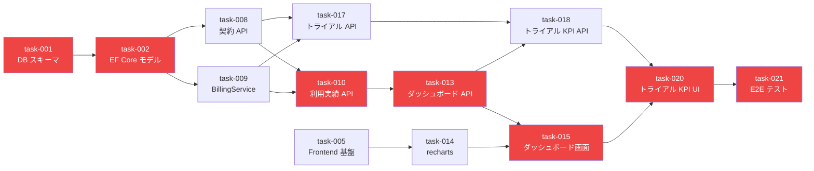

# SaaS管理アプリ 作業プラン サマリ

## 概要

自社 SaaS 製品の契約・運用を一元管理する Web アプリケーションの開発プラン。
Excel 運用からの脱却を目指し、契約管理・月次集計の自動化・ダッシュボードによる可視化を実現する。

4フェーズ構成で段階的に機能をリリースする:
1. **Phase 1**: 基盤構築 + マスタ管理（DB・製品・顧客）
2. **Phase 2**: 契約管理 + 利用実績（課金計算含む）
3. **Phase 3**: ダッシュボード + 分析
4. **Phase 4**: トライアル機能 + E2E テスト

## 作業一覧

| ID | タイトル | 実行場所 | 依存 | 並行可 |
|---|---|---|---|---|
| task-001 | データベーススキーマ作成とシードデータ投入 | local | - | No |
| task-002 | EF Core エンティティモデルと DbContext 定義 | delegate | task-001 | No |
| task-003 | 製品・課金プラン API（CRUD） | delegate | task-002 | Yes |
| task-004 | 顧客 API（CRUD） | delegate | task-002 | Yes |
| task-005 | フロントエンド ルーティング・レイアウト・共通コンポーネント | delegate | - | Yes |
| task-006 | 製品管理画面（一覧・詳細・登録・編集） | delegate | task-003, task-005 | Yes |
| task-007 | 顧客管理画面（一覧・詳細・登録・編集） | delegate | task-004, task-005 | Yes |
| task-008 | 契約 API（CRUD・プラン変更・解約・変更履歴） | delegate | task-002 | Yes |
| task-009 | BillingService（請求額計算ロジック） | delegate | task-002 | Yes |
| task-010 | 利用実績 API（登録・一括登録・一覧） | delegate | task-008, task-009 | No |
| task-011 | 契約管理画面（一覧・詳細・プラン変更・解約） | delegate | task-008, task-005 | Yes |
| task-012 | 利用実績画面（一覧・登録・請求額プレビュー） | delegate | task-010, task-005 | No |
| task-013 | ダッシュボード API（売上集計・顧客サマリ） | delegate | task-010 | Yes |
| task-014 | recharts 導入とチャートコンポーネント | delegate | task-005 | Yes |
| task-015 | ダッシュボード画面（KPI・売上推移・製品比率・顧客ランキング） | delegate | task-013, task-014 | No |
| task-016 | 顧客詳細画面に利用量・請求額グラフ追加 | delegate | task-007, task-014 | Yes |
| task-017 | トライアル API（CRUD・本契約転換・期限切れ処理） | delegate | task-008, task-009 | Yes |
| task-018 | ダッシュボード トライアル KPI API | delegate | task-017, task-013 | No |
| task-019 | トライアル管理画面（一覧・開始・転換・キャンセル） | delegate | task-017, task-005 | Yes |
| task-020 | ダッシュボードにトライアル KPI 統合 | delegate | task-018, task-015 | No |
| task-021 | E2E テスト（Playwright + Testcontainers） | local | task-020 | No |

## クリティカルパス

**クリティカルパス**: task-001 → task-002 → task-008/009 → task-010 → task-013 → task-015 → task-020 → task-021

## 並行実行グループ

- **Group A（Sequential - 基盤）**: task-001 → task-002
- **Group B（Parallel, task-002 完了後 - バックエンド API）**: task-003 | task-004 | task-008 | task-009
- **Group C（Parallel, 即時開始可 - フロントエンド基盤）**: task-005
- **Group D（Parallel, Phase 1 API + task-005 完了後）**: task-006 | task-007 | task-011
- **Group E（Sequential, task-008 + task-009 完了後）**: task-010 → task-012
- **Group F（Parallel, task-005 完了後）**: task-014
- **Group G（Parallel, task-010 完了後）**: task-013 | task-017
- **Group H（Sequential, task-013 + task-014 完了後）**: task-015
- **Group I（Parallel, task-007 + task-014 完了後）**: task-016
- **Group J（Parallel, task-017 完了後）**: task-018 | task-019
- **Group K（Sequential, task-018 + task-015 完了後）**: task-020
- **Group L（Sequential, 全タスク完了後）**: task-021

## リスクと注意事項

| リスク | 影響度 | 対策 |
|--------|--------|------|
| 課金ロジックの複雑性（固定・従量・ハイブリッド + 年契割引） | 高 | task-009 の BillingService テストを最優先で充実させる |
| シードデータの整合性（FK 制約、計算値の一致） | 中 | シードデータ SQL の冪等性確保、計算例との一致を検証 |
| フロントエンド共通コンポーネントの品質 | 中 | task-005 を早期に着手し、後続タスクの基盤を安定させる |
| recharts の学習コスト | 低 | 軽量ライブラリで学習容易、公式サンプルが充実 |
| Testcontainers の E2E テスト環境構築 | 中 | Docker-in-Docker 構成のため、task-021 はローカル実行必須 |
| v1 では認証なし → 将来の RBAC 追加 | 低 | API 設計時にアクセス制御の拡張ポイントを意識 |
