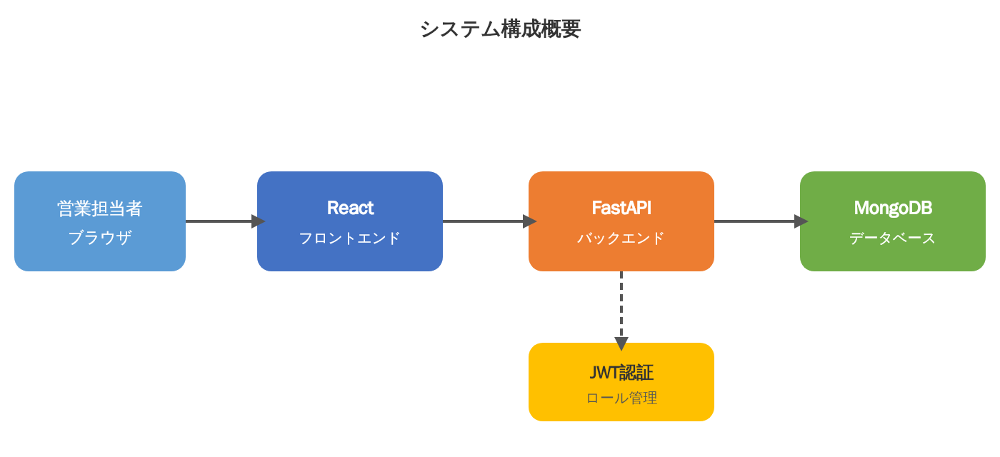
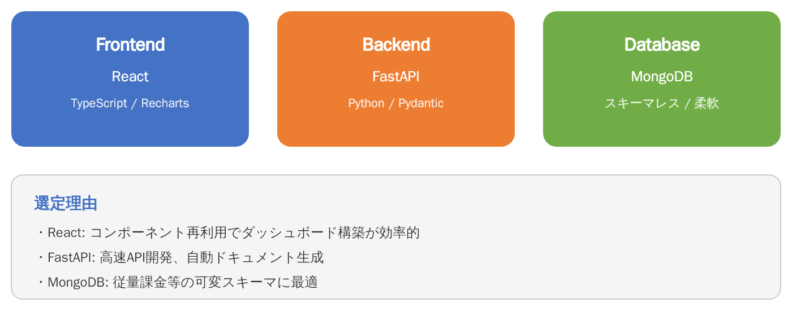

# システム構成・技術スタック

## システム構成図



```
営業担当者(ブラウザ) → React(フロントエンド) → FastAPI(バックエンド) → MongoDB(データベース)
                                                       ↓
                                                  JWT認証(ロール管理)
```

## 技術スタック



### Frontend

| 項目 | 技術 |
|---|---|
| フレームワーク | **React** |
| 言語 | **TypeScript** |
| グラフライブラリ | **Recharts** |

**選定理由:** コンポーネント再利用でダッシュボード構築が効率的

### Backend

| 項目 | 技術 |
|---|---|
| フレームワーク | **FastAPI** |
| 言語 | **Python** |
| バリデーション | **Pydantic** |

**選定理由:** 高速API開発、自動ドキュメント生成（OpenAPI/Swagger）

### Database

| 項目 | 技術 |
|---|---|
| データベース | **MongoDB** |
| 特性 | スキーマレス / 柔軟 |

**選定理由:** 従量課金等の可変スキーマに最適。項目が変動しやすいデータはMongoDBのスキーマレスが相性良い（大川氏の判断）

### 認証

| 項目 | 技術 |
|---|---|
| 認証方式 | **JWT認証** |
| 実装場所 | FastAPI側で自前JWT認証基盤 |

## 技術選定の経緯

Teams議論での検討ポイント：

- **ワタナベPM:** 社内用アプリなので、当初はEntra ID SSO連携を想定
- **大川氏:** FastAPI側で自前のJWT認証基盤を組む方がカスタマイズしやすい。技術的にはこちらの方が柔軟
- **結論:** FastAPI + JWT認証を採用。ロールは営業担当者と管理者の2つで分ける方針

フロントReact + バックエンドFastAPI + MongoDBの構成は、大川氏が「利用状況のダッシュボードもこの構成ならサクッと作れる」と評価。
