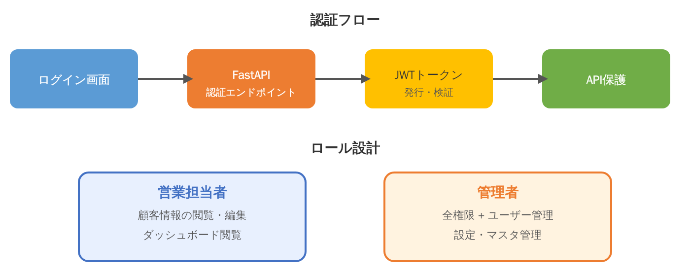
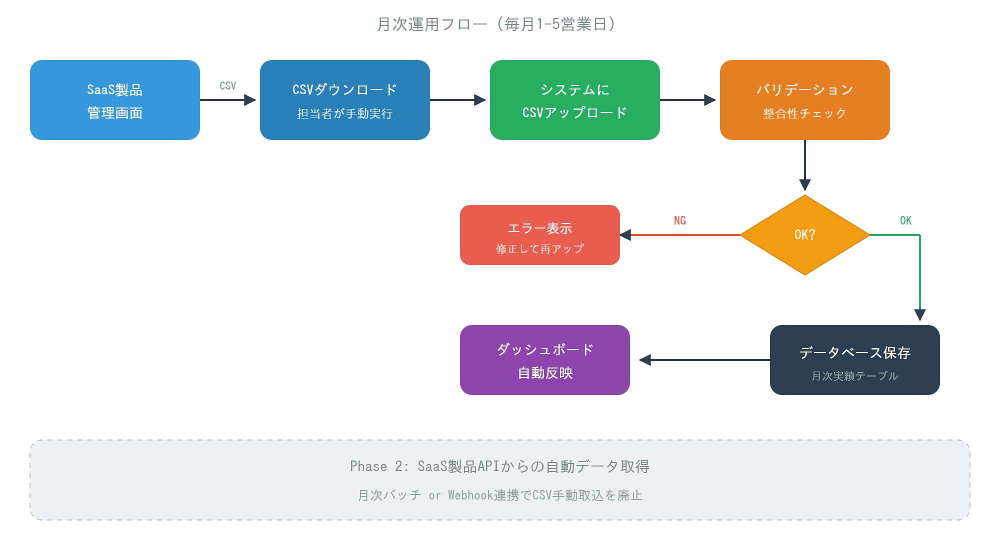

# 認証・権限設計・運用フロー

## 認証フロー



```
ログイン画面 → FastAPI認証エンドポイント → JWTトークン(発行・検証) → API保護
```

### 認証方式

- FastAPI側で**自前のJWT認証基盤**を構築
- 当初はEntra ID SSO連携も検討されたが（ワタナベPM）、カスタマイズの柔軟性を重視してJWT自前実装を採用（大川氏の提案）

### トークンフロー

1. ユーザーがログイン画面でID/パスワードを入力
2. FastAPIの認証エンドポイントでクレデンシャルを検証
3. 有効な場合、JWTトークンを発行（ロール情報含む）
4. 以降のAPIリクエストはBearerトークンで認証・認可

## ロール設計

2つのロールで権限を分離する。

### 営業担当者ロール

| 操作 | 権限 |
|---|---|
| 顧客情報 | 閲覧・編集 |
| ダッシュボード | 閲覧 |
| 契約情報 | 閲覧・編集（担当顧客のみ） |
| 従量データ取込 | 実行可能 |
| マスタ管理 | 閲覧のみ |

### 管理者ロール

| 操作 | 権限 |
|---|---|
| 全機能 | 全権限 |
| ユーザー管理 | 追加・編集・削除 |
| 設定・マスタ管理 | CRUD全操作 |
| 全顧客データ | 横断閲覧・編集 |

## 従量課金データ更新フロー



### 月次運用フロー（毎月1-5営業日）

```
SaaS製品管理画面 → CSVダウンロード(担当者が手動実行) → システムにCSVアップロード
    → バリデーション(整合性チェック) → OK? → データベース保存(月次実績テーブル)
                                       → NG? → エラー表示(修正して再アップ)
    → ダッシュボード自動反映
```

### 運用ルール

| 項目 | 内容 |
|---|---|
| 更新頻度 | 月次（毎月1〜5営業日目） |
| 更新担当 | 営業担当者（各SaaS製品からCSVダウンロード） |
| Phase 1方式 | CSV手動取込（現行運用を踏襲） |
| Phase 2方式 | SaaS製品APIからの自動データ取得 |

### ワタナベPMの指示事項

- 従量データ取込について、プロトに入る前に運用面を詰めること
- 更新フロー（月次バッチか手動アップロードか）を明確にしてから実装に入る
- 大川氏に次回までに従量課金の更新フロー（月中の単価変更対応含む）を企画書に追記するよう指示
- サトウ氏にも運用面でレビューを依頼

### 月中の単価変更対応

サトウ氏の指摘：「現場だと月中に単価変更が入ることもある」

→ 大川氏が更新フローに反映予定。具体的な対応方針：
- 月中単価変更は日割りでの按分計算を想定
- 変更履歴をプラン変更履歴として記録

## Phase 2: API自動連携

将来的にCSV手動取込を廃止し、SaaS製品APIから直接データを取得する。

- **月次バッチ** or **Webhook連携** でCSV手動取込を廃止
- 大川氏：「Phase 2でAPI自動連携も見据えているが、まずCSV取込でプロト作ってみましょうか」
