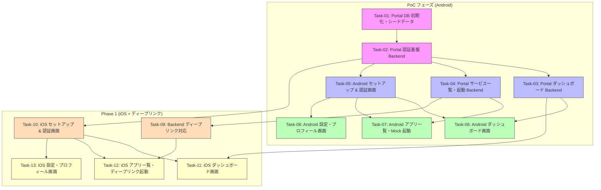

# SaaS ポータル スマホアプリ — 開発計画サマリ

## 概要

SaaS ポータル スマホアプリ（PoC フェーズ）の開発計画。
エンドユーザー向けに、テナント単位の SaaS 利用状況可視化とアプリ起動ポータルを Android アプリとして提供する。

### スコープ

**PoC フェーズ（Android-first）** に絞り、以下 3 つのコア機能を実装する:

1. **JWT 認証** — テナントスコープのサインアップ / ログイン / トークンリフレッシュ
2. **テナントダッシュボード** — 利用状況サマリー、月次推移グラフ、利用目的別集計
3. **Mock アプリ起動** — 契約サービス一覧表示、起動ボタン（PoC では Mock）

### プラットフォーム

| レイヤー | 技術スタック | フェーズ |
|---------|------------|---------|
| Android | Kotlin + Jetpack Compose + Hilt + Retrofit | PoC |
| iOS | Swift + SwiftUI + Swift Charts | Phase 1 |
| Backend | FastAPI + Pydantic v2 + Motor (MongoDB 非同期) | PoC |
| Database | MongoDB 7 (`portal_*` プレフィックスコレクション) | PoC |
| Auth | JWT (`python-jose` + `bcrypt`) — テナントスコープ | PoC |

### 下流パイプライン

```
[dev-plan] → mobile-implement → mobile-unit-test → maestro-generate-test
```

---

## タスク一覧

### PoC フェーズ（Android-first）

| Task ID | タスク名 | 優先度 | 依存先 | 並行可 | AC 数 |
|---------|---------|--------|--------|--------|-------|
| Task-01 | Portal DB 初期化・シードデータ | 高 | なし | Yes | 4 |
| Task-02 | Portal 認証基盤 Backend | 高 | Task-01 | No | 7 |
| Task-03 | Portal ダッシュボード Backend | 高 | Task-02 | Yes | 5 |
| Task-04 | Portal サービス一覧・起動 Backend | 高 | Task-02 | Yes | 5 |
| Task-05 | Android プロジェクトセットアップ & 認証画面 | 高 | Task-02 | Yes | 7 |
| Task-06 | Android ダッシュボード画面 | 高 | Task-03, Task-05 | Yes | 5 |
| Task-07 | Android アプリ一覧・Mock 起動画面 | 高 | Task-04, Task-05 | Yes | 5 |
| Task-08 | Android 設定・プロフィール画面 | 中 | Task-05 | Yes | 4 |

### Phase 1（iOS 版追加 + ディープリンク）

| Task ID | タスク名 | 優先度 | 依存先 | 並行可 | AC 数 |
|---------|---------|--------|--------|--------|-------|
| Task-09 | Backend ディープリンク対応 | 高 | Task-04 | Yes | 4 |
| Task-10 | iOS プロジェクトセットアップ & 認証画面 | 高 | Task-02 | Yes | 6 |
| Task-11 | iOS ダッシュボード画面 | 高 | Task-03, Task-10 | Yes | 5 |
| Task-12 | iOS アプリ一覧・ディープリンク起動画面 | 高 | Task-09, Task-10 | Yes | 5 |
| Task-13 | iOS 設定・プロフィール画面 | 中 | Task-10 | Yes | 4 |

---

## 依存関係図



---

## 推奨実行順序

### Wave 1

- **Task-01**: Portal DB 初期化・シードデータ

### Wave 2（Wave 1 完了後）

- **Task-02**: Portal 認証基盤 Backend

### Wave 3（Wave 2 完了後 — 並行実行可）

- **Task-03**: Portal ダッシュボード Backend
- **Task-04**: Portal サービス一覧・起動 Backend
- **Task-05**: Android プロジェクトセットアップ & 認証画面
- **Task-10**: iOS プロジェクトセットアップ & 認証画面

### Wave 4（Wave 3 完了後 — 並行実行可）

- **Task-06**: Android ダッシュボード画面
- **Task-07**: Android アプリ一覧・Mock 起動画面
- **Task-08**: Android 設定・プロフィール画面
- **Task-09**: Backend ディープリンク対応
- **Task-13**: iOS 設定・プロフィール画面

### Wave 5（Wave 4 完了後 — 並行実行可）

- **Task-11**: iOS ダッシュボード画面
- **Task-12**: iOS アプリ一覧・ディープリンク起動画面

---

## 前提確認事項

1. **データ同期方式**: PoC フェーズではポータル用シードデータを手動投入する。管理アプリ（`customers`, `contracts`）との自動同期は Phase 1 で設計する
2. **Android エミュレータ環境**: DevContainer 内で Android エミュレータを実行するか、外部端末でテストするかは環境に依存する
3. **チャートライブラリ**: Android のグラフ描画には `Vico` (Jetpack Compose 対応) または `MPAndroidChart` を想定。PoC では Compose Canvas でシンプルに実装する選択肢もある
4. **トークン保存**: Android では `EncryptedSharedPreferences` (AndroidX Security) または `DataStore` を使用する
5. **Backend テスト用 API**: Maestro E2E テスト向けのシードデータ投入 API (`/api/test/seed`) は Task-01 のシードスクリプトとは別途検討が必要
6. **ボトムナビゲーション**: Task-05 でナビゲーション基盤（3 タブ + プレースホルダー）を構築し、Wave 4 の Task-06/07/08 では画面実装のみに集中する設計とした。これにより Wave 4 の並行実行時のマージコンフリクトを回避する
