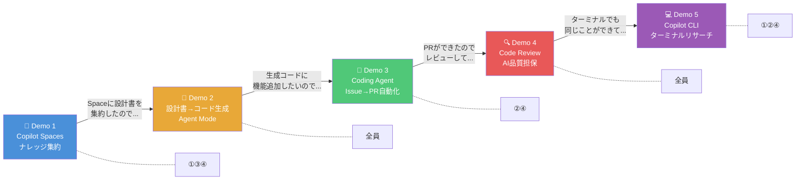
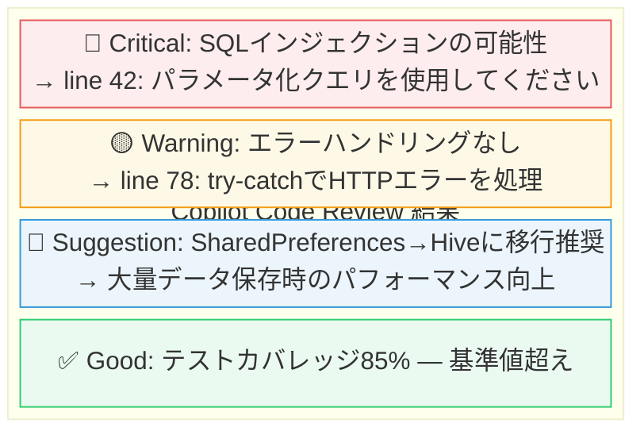
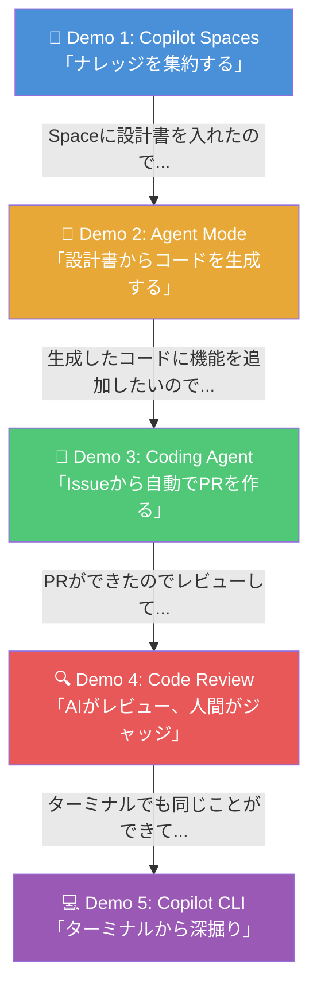

# Workshop デモ構成

> `talk-thema.md` の参加者プロファイル・共通テーマ・事前ディスカッションの論点を踏まえ、最新機能（2026年3月時点）をベースに構成したデモプラン。

## デモ全体マップ



### 参加者カバレッジ

| デモ | ①技術責任者 | ②ネイティブEng | ③SW Eng | ④EM | 対応テーマ |
|------|:-----------:|:-------------:|:-------:|:---:|-----------|
| Demo 1 | ★ | ○ | ★ | ★ | 情報分散の解消、社内ナレッジ、MS365連携 |
| Demo 2 | ★ | ★ | ★ | ★ | 設計書→コード生成、マルチFW、プロンプト設計 |
| Demo 3 | ○ | ★ | ○ | ★ | タスク分割、チーム効率化、エージェント統合 |
| Demo 4 | ★ | ○ | ★ | ★ | レビュー観点、セキュリティ、品質担保 |
| Demo 5 | ★ | ★ | ○ | ★ | 既存コード理解、CLI/SDKフロー制御 |

★ = 強く刺さる / ○ = 関連あり

---

## Demo 1: Copilot Spaces — 分散ナレッジの集約（10分）

### 対象テーマ
- 情報分散の解消とMS365連携（①④の強い期待）
- 社内ナレッジ活用（③④）
- プロンプト設計力の底上げ

### 背景（事前ディスカッションから）
> 業務情報が総務・Slack・メール・Teamsに分散。チャットベース情報は名前付けが不十分で発見性が低い。セマンティックサーチはできているがエージェンティックサーチは未対応。

### デモストーリー

**「バラバラの情報を1箇所に集めて、Copilotの回答精度を劇的に上げる」**

#### Step 1: Copilot Spaceの作成（2分）

github.com/copilot/spaces で新規Space作成。以下を追加：

- **リポジトリ**: デモ用リポジトリ（コードが自動同期される[^1]）
- **設計書**: `design-spec.md`（Workshop本編で使用する設計書）
- **コーディング規約**: `coding-standards.md`
- **セキュリティガイドライン**: `security-policy.md`
- **カスタムインストラクション**: プロジェクト固有のルール

```
📁 Copilot Space: "ポイントカード開発"
├── 📂 リポジトリ: point-card-app (自動同期)
├── 📄 設計書: design-spec.md
├── 📄 コーディング規約: coding-standards.md
├── 📄 セキュリティ: security-policy.md
└── 📝 カスタムインストラクション:
    "Flutter 3.x + riverpod使用。Dart Analysis厳格モード。
     APIはOpenAPI 3.0準拠。日本語コメント推奨。"
```

#### Step 2: Spaceに質問してみる（3分）

Space上のCopilot Chatに質問：

```
Q: このプロジェクトのユーザー認証はどう設計されている？
```
→ Space内の設計書・コードから**プロジェクト固有の回答**を返す

```
Q: セキュリティ基準に準拠した新しいAPIエンドポイントの雛形を作って
```
→ セキュリティガイドラインを参照したコードを生成

#### Step 3: IDE連携（MCP経由）（3分）

VS Codeの `.vscode/mcp.json` にGitHub MCP Serverを設定[^2]：

```json
{
  "servers": {
    "github": {
      "url": "https://api.githubcopilot.com/mcp/"
    }
  }
}
```

VS Code上のCopilot ChatからSpaceコンテキストを参照しながらコーディング。
IDE内でも「Space内の設計書に基づいて」という精度の高い回答が得られる。

#### Step 4: 共有とオンボーディング活用（2分）

- Spaceをチーム/Org内で共有設定
- 新メンバーがSpaceに質問するだけでプロジェクトのコンテキストを即座に把握
- 「暗黙知」が構造化される → **参加者②の既存コード理解課題にも対応**

### 参加者への問いかけ
> 「皆さんの社内で、ドキュメントが一番散らばっている場所はどこですか？それをSpaceに入れるとしたら何を優先しますか？」

---

## Demo 2: 設計書 → マルチプラットフォームコード生成（15分）

### 対象テーマ
- 設計書からのコード生成（Workshop本編の核）
- マルチ言語・マルチFW（②③④）
- プロンプト設計力（事前議論で組織的課題）
- ドキュメントベース新規開発（事前議論で合意済み方針）

### デモストーリー

**「1つの設計書から、Flutter/Vue.js/Kotlinの3つのコードを一気に生成する」**

#### 準備: リポジトリの構造

```
point-card-app/
├── .github/
│   ├── copilot-instructions.md          # プロジェクト全体ルール
│   ├── instructions/
│   │   ├── flutter.instructions.md      # Flutter固有ルール
│   │   ├── vuejs.instructions.md        # Vue.js固有ルール
│   │   └── kotlin.instructions.md       # Kotlin固有ルール
│   └── prompts/
│       └── implement-from-spec.prompt.md # 設計書→実装の再利用プロンプト
├── docs/
│   └── user-management-spec.md          # 設計書
├── src/
│   ├── flutter/
│   ├── vuejs/
│   └── kotlin/
```

#### Step 1: Custom Instructions の設定（3分）

**`.github/copilot-instructions.md`**（プロジェクト共通）[^3]：
```markdown
# プロジェクト規約
- 日本語コメントを使用
- エラーハンドリングは必ず実装する
- テストコードを同時に生成する
- REST APIはOpenAPI 3.0仕様に準拠
- 認証はJWT Bearer Token
```

**`.github/instructions/flutter.instructions.md`**（Flutter固有）：
```markdown
---
applyTo: "src/flutter/**"
---
# Flutter規約
- riverpodでステート管理
- Material Design 3準拠
- freezedでイミュータブルモデル
- go_routerでルーティング
```

#### Step 2: Prompt File の作成（2分）

**`.github/prompts/implement-from-spec.prompt.md`**[^4]：
```markdown
---
description: 設計書からコードを生成する
name: implement-from-spec
agent: agent
tools:
  - file_edit
  - terminal
---
#file:docs/user-management-spec.md を読み込み、
以下の手順でコードを生成してください：

1. 設計書のエンティティ定義からモデルクラスを生成
2. API仕様からサービス層を生成
3. 画面仕様からUI層を生成
4. 各層のユニットテストを生成
5. ビルドして動作確認
```

#### Step 3: Agent Modeで生成実行（8分）

VS Code Copilot ChatでAgent Modeを選択し、設計書を参照して生成：

**Flutter向け:**
```
/implement-from-spec
Flutter/Dart で src/flutter/ 以下に実装してください。
ユーザー一覧画面とユーザー詳細画面を生成。
```

Agent Modeが自律的に[^5]：
1. `docs/user-management-spec.md` を解析
2. `.github/instructions/flutter.instructions.md` のルールを適用
3. モデル → サービス → UI → テストの順で複数ファイルを生成
4. `flutter analyze` / `flutter test` を実行
5. エラーがあれば自己修復して再実行

**Vue.js向け（比較デモ）:**
```
/implement-from-spec
Vue.js 3 + Composition API で src/vuejs/ 以下に実装してください。
同じユーザー管理画面を生成。
```

#### Step 4: 生成結果の比較（2分）

| 観点 | Flutter生成結果 | Vue.js生成結果 |
|------|----------------|---------------|
| モデル層 | freezed + json_serializable | TypeScript interface + zod |
| 状態管理 | riverpod Provider | Composition API + ref/reactive |
| UI | Material3 Widget | Vue Template + Tailwind |
| テスト | flutter_test + mockito | Vitest + Vue Test Utils |

→ **同じ設計書でもFW固有のベストプラクティスが反映される**ことを見せる

### 参加者への問いかけ
> 「今日持ってきた設計書で、一番最初に生成してみたい部分はどこですか？」

---

## Demo 3: Coding Agent — Issue → PR 自動化（12分）

### 対象テーマ
- タスク分割の粒度（②の課題 — 「粒度分割もAIの仕事にしてよい」）
- チーム開発の効率化
- Copilot/エージェントの統合運用（2-4のテーマ）

### デモストーリー

**「Issueを書いて@copilotにアサインするだけで、PRが自動で生まれる」**

#### Step 1: 良いIssueの書き方（タスク分割のベストプラクティス）（3分）

**適切な粒度の例**[^6]：

```markdown
## タスク: ダークモード切替の実装

### 概要
設定画面にダークモード切替トグルを追加する。

### 受け入れ基準
- [ ] 設定画面にMaterial3のSwitchウィジェットを追加
- [ ] 選択状態をSharedPreferencesに永続化
- [ ] ThemeProviderでアプリ全体のテーマを即座に切替
- [ ] 既存テストが全てパスすること
- [ ] ダークモード切替のウィジェットテストを追加

### 関連ファイル
- `src/flutter/lib/screens/settings_screen.dart`
- `src/flutter/lib/providers/theme_provider.dart`

### 技術的制約
- Flutter 3.x / riverpod / Material Design 3
```

**❌ 大きすぎる例:**
```
「認証機能全体を実装して」→ スコープが広すぎ、精度低下
```

**❌ 小さすぎる例:**
```
「変数名をcamelCaseに統一して」→ オーバーヘッド過大
```

**粒度の判断基準:**

| 条件 | 判定 |
|------|------|
| 1つのPRで完結する | ✅ 適切 |
| 受け入れ基準が明確に書ける | ✅ 適切 |
| テストで検証可能 | ✅ 適切 |
| 複数画面/モジュールにまたがる | ⚠️ 分割検討 |
| 「〜全体」「〜一式」という表現 | ❌ 分割必須 |

#### Step 2: @copilotにアサイン（2分）

GitHub Issue画面で Assignees に `@copilot` を追加[^7]


#### Step 3: Agentsタブで進捗を確認（3分）

リポジトリの **Agents** タブ[^8]でリアルタイム確認：
- エージェントのステップバイステップの推論ログ
- 変更されたファイル一覧
- テスト実行結果

#### Step 4: PRレビュー＆フィードバックループ（4分）

生成されたDraft PRに対してコメント：
```
> テーマ切替のアニメーションを300msに設定してください
```
→ Coding Agentがコメントを読み取り、コードを追加修正してPRを更新

### 参加者への問いかけ
> 「今のプロジェクトで、Issueに@copilotをアサインしたら一番効果的なタスクは何ですか？」

---

## Demo 4: Code Review Agent — AI生成コードの品質担保（10分）

### 対象テーマ
- レビュー観点（AI生成コードのレビュー基準）
- セキュリティ・品質担保
- GitHub Copilotのコードレビュー活用（事前議論で有効性共有済み）

### デモストーリー

**「AI が作ったコードを AI がレビューする。人間はジャッジに集中する」**

#### Step 1: Demo 3で作成されたPRにCode Reviewをリクエスト（2分）

PRのReviewers に Copilot を追加、またはPR画面から「Copilot Review」をクリック

#### Step 2: Copilot Code Reviewの結果確認（4分）

Copilot Code Review (CCR) が以下を検出[^9]：

**セキュリティ（CodeQL統合）:**
- SQLインジェクション、XSSのリスク箇所
- ハードコードされたシークレット

**品質（LLM推論）:**
- エラーハンドリングの不足
- Null安全性の問題
- パフォーマンス改善の提案（N+1クエリ等）

**スタイル（ESLint/Dart Analyzer連携）:**
- コーディング規約違反
- 未使用インポート



#### Step 3: @copilotに自動修正を依頼（2分）

レビューコメントに対して[^10]：
```
@copilot このSQLインジェクションの指摘を修正して
```
→ Copilot Coding Agentがstacked PR（修正用PR）を自動作成

#### Step 4: カスタムレビュー基準の設定（2分）

`.github/copilot-instructions.md` にレビュー観点を追加[^11]：
```markdown
## Code Review基準
- セキュリティ: OWASP Top 10を必ずチェック
- テスト: 新規publicメソッドにはユニットテスト必須
- パフォーマンス: リスト操作でO(n²)以上は警告
- アクセシビリティ: Semanticsラベルの付与を確認
```

### 参加者への問いかけ
> 「人間のレビューとAIのレビュー、それぞれどの観点に集中させるのが最適だと思いますか？」

---

## Demo 5: Copilot CLI — ターミナルから深掘りリサーチ（8分）

### 対象テーマ
- CLIのResearchモード活用（2-1のテーマ）
- 既存コードベースの理解支援（②の課題）
- CLI/SDKによるフロー制御（2-2のテーマ）

### デモストーリー

**「ターミナルから離れずに、コードベースの全体像を一発で把握する」**

#### Step 1: /research でコードベース調査（3分）

```bash
$ ghcs
> /research このプロジェクトのアーキテクチャを図解して。
  主要コンポーネント、データフロー、依存関係を整理して。
```

Copilot CLIが自動的に[^12]：
- リポジトリ内のファイルを探索
- アーキテクチャを分析
- 引用付きMarkdownレポートを生成
- 図解（ASCIIダイアグラム）付き

→ **参加者②の「既存コード理解」課題を直接解決**

#### Step 2: Agent Modeでコード変更（3分）

```bash
$ ghcs
> このリポジトリの設定画面にダークモードの切替機能を追加して。
  既存のThemeProviderを拡張する形で、Material Design 3準拠で実装して。
```

Agent Modeの動作[^13]：
1. 対象ファイルの分析
2. 変更計画の提示（承認を求める）
3. コード変更の実行
4. テスト実行・エラー修正
5. 変更サマリーの表示

#### Step 3: Autopilot vs 対話モードの使い分け（2分）

| モード | 用途 | セキュリティ |
|--------|------|-------------|
| **対話モード** | 各ステップで承認を求める | 高（本番向き） |
| **Autopilotモード** | 全ステップ自動実行 | 中（プロトタイプ向き） |
| **Plan モード** | 計画のみ作成し実行しない | 最高（レビュー向き） |

```bash
# Planモードで計画だけ確認
$ ghcs --plan "認証フローにMFAを追加する計画を立てて"

# Autopilotで一気に実行
$ ghcs --autopilot "READMEにAPI仕様のセクションを追加して"
```

→ **事前議論の「CLI/SDKによるフロー制御 — 決定論的に区切る設計」に対応**

### 参加者への問いかけ
> 「ターミナルでCopilotが使えるとしたら、まず何を調べさせたいですか？」

---

## デモ間のストーリーライン



**開発ライフサイクルの End-to-End** を1つのストーリーで見せることで、個別機能の紹介ではなく**日常業務に直結する価値**を体感してもらう。

---

## 推奨タイムライン

### フル構成（55分）

| 順序 | デモ | 時間 | 内容 |
|------|------|------|------|
| 1 | Demo 1: Copilot Spaces | 10分 | ナレッジ集約 + IDE連携 |
| 2 | Demo 2: 設計書→コード生成 | 15分 | Agent Mode + Custom Instructions + Prompt Files |
| 3 | Demo 3: Coding Agent | 12分 | Issue→PR + タスク分割ベストプラクティス |
| 4 | Demo 4: Code Review | 10分 | CodeQL統合 + 自動修正 |
| 5 | Demo 5: Copilot CLI | 8分 | /research + Agent Mode |

### コンパクト構成（30分）

| 順序 | デモ | 時間 | 内容 |
|------|------|------|------|
| 1 | Demo 2: 設計書→コード生成 | 15分 | Workshop核。全員に刺さる |
| 2 | Demo 3+4: Issue→PR→Review | 12分 | 自動化の一連の流れ |
| 3 | Demo 1: Spaces紹介 | 3分 | 概要のみ |

---

## 事前準備チェックリスト

### 環境

- [ ] GitHub Copilot Business または Enterprise ライセンス
- [ ] VS Code 最新版 + GitHub Copilot Extension
- [ ] Copilot CLI インストール済み（`gh extension install github/gh-copilot`）
- [ ] GitHub MCP Server 設定済み（`.vscode/mcp.json`）
- [ ] 安定したインターネット接続

### デモ用リポジトリ

- [ ] `point-card-app` リポジトリ作成済み
- [ ] `.github/copilot-instructions.md` 設定済み
- [ ] `.github/instructions/` に各FW用ルール配置
- [ ] `.github/prompts/implement-from-spec.prompt.md` 配置
- [ ] `docs/user-management-spec.md` 設計書配置
- [ ] Copilot Space 作成・リポジトリ紐付け済み
- [ ] Demo 3用のIssue事前作成（下書き状態）
- [ ] Demo 4用の意図的脆弱性コード（SQLインジェクション等）

### コンテンツ

- [ ] ポイントカードのサンプル設計書（畠山担当）
- [ ] 適切／不適切なIssue粒度の例
- [ ] バックアップ用スクリーンショット（デモ失敗時）

---

## Footnotes

[^1]: Copilot Spacesはリポジトリと自動同期。[Copilot Spaces GA](https://github.blog/changelog/2025-09-24-copilot-spaces-is-now-generally-available/)
[^2]: GitHub MCP Server設定。[GitHub Docs](https://docs.github.com/copilot/how-tos/provide-context/use-mcp/set-up-the-github-mcp-server)
[^3]: Custom Instructions。[GitHub Copilot Custom Instructions Complete Guide](https://smartscope.blog/en/generative-ai/github-copilot/github-copilot-custom-instructions-guide/)
[^4]: Prompt Files。[VS Code Docs](https://code.visualstudio.com/docs/copilot/customization/prompt-files) / [GitHub Docs](https://docs.github.com/en/copilot/tutorials/customization-library/prompt-files)
[^5]: Agent Mode。[Agent mode 101](https://github.blog/ai-and-ml/github-copilot/agent-mode-101-all-about-github-copilots-powerful-mode/) / [VS Code 1.112](https://visualstudiomagazine.com/articles/2026/03/19/vs-code-1-112-adds-integrated-browser-debugging-more-copilot-cli-control.aspx)
[^6]: タスク分割ベストプラクティス。[Best practices for using GitHub Copilot to work on tasks](https://docs.github.com/en/copilot/tutorials/coding-agent/get-the-best-results)
[^7]: Coding Agent。[From idea to PR](https://github.blog/ai-and-ml/github-copilot/from-idea-to-pr-a-guide-to-github-copilots-agentic-workflows/)
[^8]: Agentsタブ。[Hands On with New GitHub Agents Tab](https://visualstudiomagazine.com/articles/2026/01/29/hands-on-new-github-agents-tab-for-repo-level-copilot-coding-agent-workflows.aspx)
[^9]: Code Review Agent + CodeQL。[Copilot Code Review public preview](https://github.blog/changelog/2025-10-28-new-public-preview-features-in-copilot-code-review-ai-reviews-that-see-the-full-picture/)
[^10]: @copilot修正ハンドオフ。[About GitHub Copilot code review](https://docs.github.com/en/copilot/concepts/agents/code-review)
[^11]: カスタムレビュー基準。[Mastering Code Reviews with GitHub Copilot](https://dev.to/pwd9000/mastering-code-reviews-with-github-copilot-the-definitive-guide-3nfp)
[^12]: Copilot CLI /research。[Researching with GitHub Copilot CLI](https://docs.github.com/en/copilot/concepts/agents/copilot-cli/research) / [Copilot CLI GA](https://github.blog/changelog/2026-02-25-github-copilot-cli-is-now-generally-available/)
[^13]: Copilot CLI Agent Mode。[Power agentic workflows in your terminal](https://github.blog/ai-and-ml/github-copilot/power-agentic-workflows-in-your-terminal-with-github-copilot-cli/) / [Copilot CLI Complete Reference](https://htekdev.github.io/copilot-cli-reference/)
